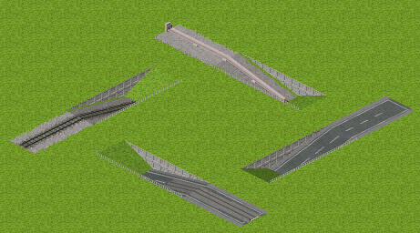

# トンネル入口スロープツール

## 機能
主にpak.nipponなどのtile_height=8であり、トンネルを地上から2層分下げる必要があるpaksetにおいて、平地からの緩坂スロープをワンクリックで作成します。

線路や道路上で1方向のみに接続している地点をクリックすると元の接続方向とは逆方向にスロープを作ります。
スロープ作成予定地点に線路があったり、クリック地点の接続方向が複数ある場合や接続が無い場合、スロープの途中をクリックした場合は実行されません。

Ctrlキーを押した状態で実行するとトンネルの入り口部分も自動で生成します
- ただし、使用されるトンネルは道の速度から近いものを適当に選びます
- この機能は予告なく変更される可能性があります



## 前提条件
simutrans/script下にtool_base.nutが配置されている必要があります。
tool_base.nutはstandard 122.0以降に同梱されていますが、単体でのダウンロードも可能です。
詳しくはsimutrans日本語化wikiをご確認ください。

## 使用方法
スクリプトツール読込ウィンドウ（dialog_tool[34]）より呼び出してください。
tunnel_entrance_slope　の名前で表示されます。

## 動作検証環境
- nightly

nightly r10077以降のバージョンが必要です

## ファイル配置
- pak.nipponの部分は各自の環境に合わせてください
```
simutrans
  └─pak.nippon
      └─tool
         └─tunnel_entrance_slope
              ├─description.tab
              └─tool.nut

```


## ライセンス
MITライセンス


## バージョン情報
- 2020/12/02 v1.0 作成
- 2020/12/03 v1.1 実行条件を変更
- 2020/12/03 v1.2 建物があるときに動かないように修正
- 2020/12/05 v1.3 掘り下げるマスの地下部分に干渉するスロープがある場合に停止できるように修正
- 2020/12/05 v2.0 公開
- 2021/01/03 v3.0 様々なwayに対応　地上にスロープがある時にエラーを吐いてしまっていたのを修正
- 2021/07/25 v4.0 路面軌道と道路の方向の差異を検出し停止するように修正　大幅なリファクタリング
- 2021/09/11 v4.1 一定のスロープ上で実行した際にもスロープを建設できるように機能を追加　到達不可能な部分のコードを削除
- 2021/10/03 v5.0 Ctrlキーを押しながらの建設で、トンネルの入口も同時に建設する機能を追加
